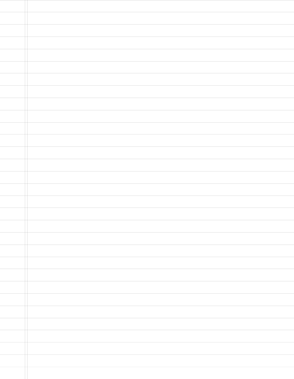

# papergen-cli

Companion CLI for papergen package (https://github.com/fdesjardins/papergen)

## Install

```
$ npm install -g papergen-cli
```

## Example

```sh
papergen -s letter -r college -o ./
xdg-open out.png
```



Then, if you want to print it:

```sh
lp out.png
```

## License

MIT © Forrest Desjardins
